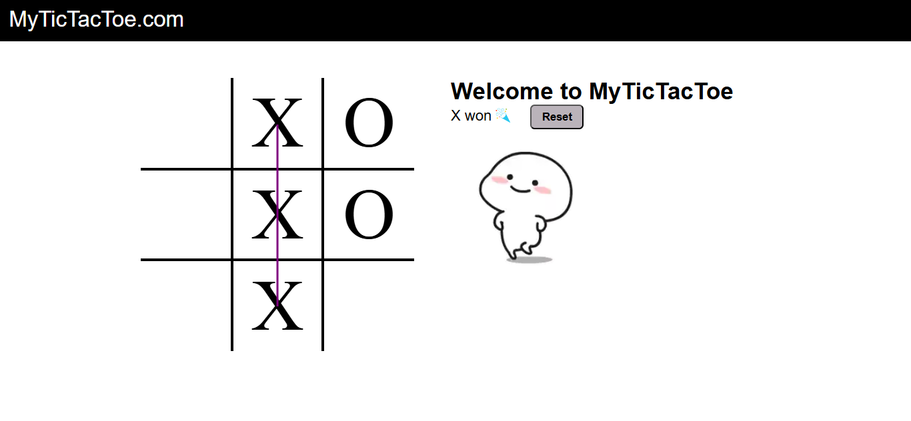
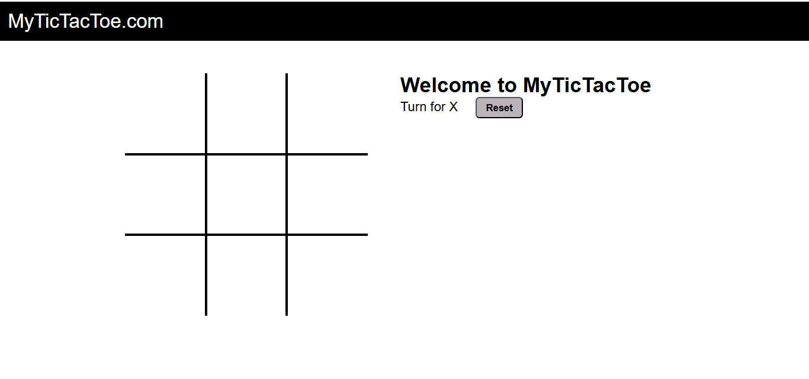

# 🎮 Tic Tac Toe Game

A simple and interactive Tic Tac Toe game built using **HTML**, **CSS**, and **Vanilla JavaScript**. Designed for two players, the game tracks turns, checks for a win or tie, and allows resetting to play again.

---

## 📸 Screenshots

### 🟢 Game Start

### 🔴 Win State

---

## 🚀 Features

- ✅ Two-player turn-based game
- ✅ Win and tie condition detection
- ✅ Reset button to start a new game
- ✅ Responsive UI with CSS styling
- ✅ Built using pure HTML/CSS/JS (no libraries)

---

## 🧱 Tech Stack

- **HTML5** – for game structure
- **CSS3** – for styling and layout
- **JavaScript (Vanilla)** – for game logic and interactivity

---
## 📂 Folder Structure

tic-tac-toe/
├── index.html
├── css/
│ └── style.css
├── js/
│ └── script.js
├── images/
│ ├── outputinitial.png
│ └── outputplayed.png
├── audio/ # (Optional: game sounds)
├── gif/ # (Optional: visual effects)
└── README.md

